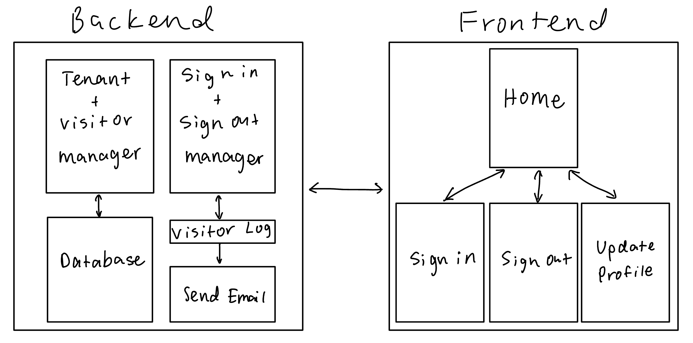

# Senior Home App


## Description
This is a prototype app for managing tenants and visitors as well as sign-in and sign-out for the Springfield Senior Center. It uses Tkinter and Python for the user interface and Python for the backend. With it, the senior center can manage which tenants and visitors are registered in each room and helps them keep a log of sign-in's and sign-out Tentant and visitor data is stored in a `json` database in `./data/` and visitor logs are stored in daily `csv` files in `./visitor-logs`. The daily log is then sent to the email address of the administrator.

## How To Run It
You must be running Python 3.10 or above. To install the dependencies, either run `pipenv install` or `pip install -r requirements.txt` depending on if you use [pipenv](https://pipenv.pypa.io/en/latest/) or pip.

To run the main workflow, run `python3 tkHome.py`. This will let you have access to all other workflows. If you want to run a specific workflow by itself, that is possible as well. 

## Examples
```
$ python3 tkHome.py
$ python3 tkSignIn.py
$ python3 tkUpdateProfile.py
```
